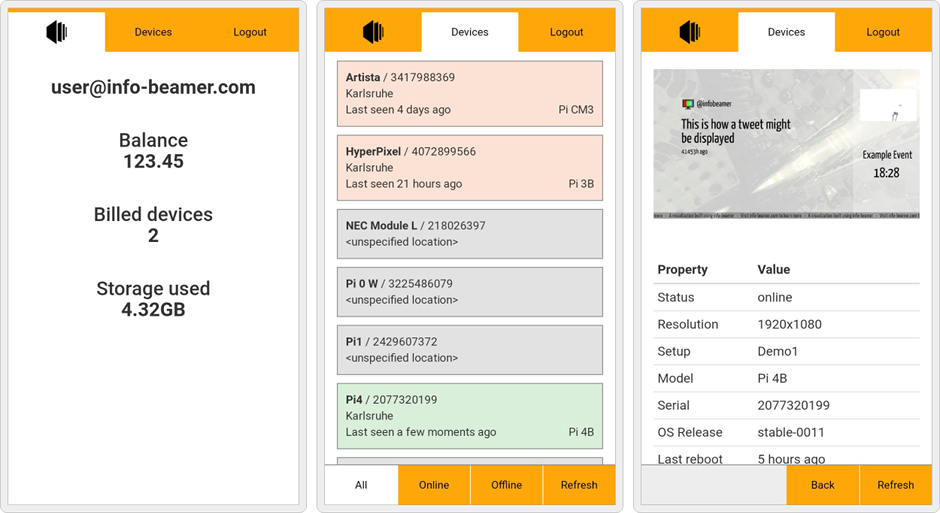

# info-beamer mobile demo application

This example shows a basic [OAuth2 based app](https://info-beamer.com/doc/oauth)
integrating into the [info-beamer hosted digital signage platform](https://info-beamer.com).

**[Try out the app here](https://demo-app.infobeamer.com)**

# On Android

 * Open the app in Chrome.
 * There should be a notification bar asking if you want to add the app to your home screen.
 * Alternatively, go to the menu and select _Add to Home screen_.
 * The app should now appear in the normal Android application list and can be started from there.

# Log in

 * Tap the _Log into your account_ button.
 * You will be redirected to info-beamer.com.
 * If you're not logged in already, log in now.
 * You'll see a screen asking you for confirmation about the access the demo app requests. Read through the request and select _Grant access to your account_.
 * You should now be logged in and check the status of your devices.
